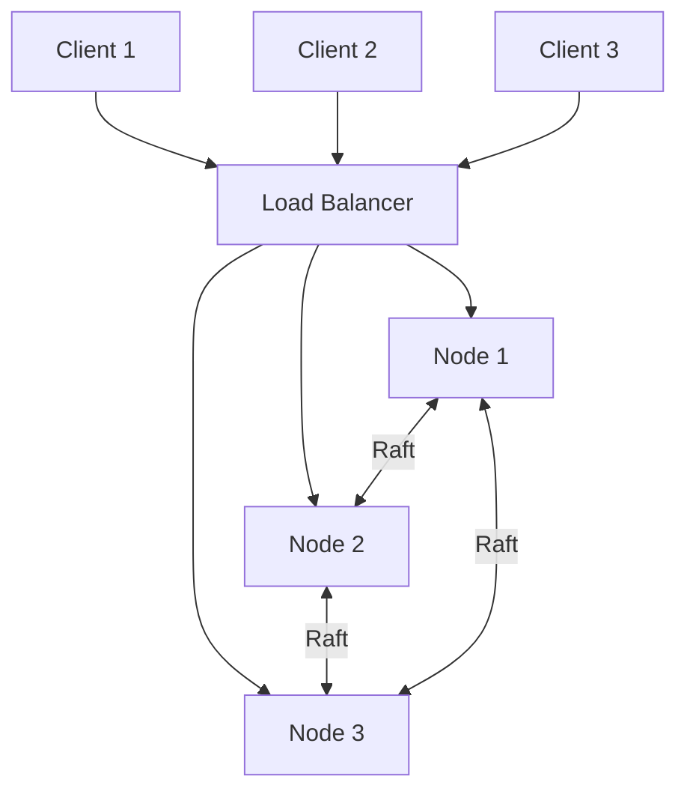

# Distri-place - Final report

Group 7 / Distributed Systems Course / 15.12.2025

## Table of Contents

- [1. Introduction](#1-introduction)
- [2. Project Goals and Core Functionality](#2-project-goals-and-core-functionality)
- [3. Design Principles](#3-design-principles)
  - [3.1 System Architecture](#31-system-architecture)
  - [3.2 Processes and Components](#32-processes-and-components)
  - [3.3 Communication Model](#33-communication-model)
  - [3.4 Mapping of Design to Source Code](#34-mapping-of-design-to-source-code)
- [4. System Functionalities](#4-system-functionalities)
  - [4.1 Global State Management](#41-global-state-management)
  - [4.2 Consistency and Synchronization](#42-consistency-and-synchronization)
  - [4.3 Consensus Mechanism](#43-consensus-mechanism)
  - [4.4 Fault Tolerance and Recovery](#44-fault-tolerance-and-recovery)
- [5. Scalability Evaluation](#5-scalability-evaluation)
- [6. Performance Evaluation](#6-performance-evaluation)
  - [6.1 Performance Metrics](#61-performance-metrics)
  - [6.2 Experimental Setup](#62-experimental-setup)
  - [6.3 Performance Results](#63-performance-results)
  - [6.4 Performance Improvements](#64-performance-improvements)
- [7. Key Enablers and Lessons Learned](#7-key-enablers-and-lessons-learned)
- [8. Groupwork](#8-groupwork)
- [9. Appendices](#9-appendices)

# 1. Introduction

This is the final report of our project Distri-place. Distri-place is a shared canvas app that allows users to distributedly work on the same graphical canvas to create works of art.

In this report we will discuss the project design and implementation goals and technology from the lens of implementing a working distributed system. We go into the core functionality and give a detailed review of how key distributed system elements such as leader election, consistency and fault tolerance are implemented, what are the roles of different nodes in our system and much more.

# 2. Project Goals and Core Functionality

## 2.1 Project Objectives

The project objective was to be a shared canvas that works seamlessly with multitude of users each working on the canvas in real time.
The distributed aspects of the project that we mainly were focusing on were replication among multiple nodes, global synchronization and availability, so that the users are always able to connect to our system.

## 2.2 Core Features

Distributed systems elements are mostly implemented via RAFT-algorithm. We concluded after our initial design ([note in appendix](#9-appendices)) that with RAFT the project gets the key features that we expect from the distributed system. Those were the consistency and global synchronization, consensus via leader election and fault tolerance in case of errors happening that might compromise the current leader.

The core feature of our application for users is the ability to collaborate in coloring individual pixels of the canvas at the same time and seeing the canvas update in near real-time. Currently there is no limit to how often a user can color a pixel but in the original implementation (reddit.com/place) there are certain restrictions in place (time limit that user has to wait before being able to color again) to improve the user experience. Also for demo the size of our canvas is relatively small but in production environment our implementation could be scaled with small modifications to code to accommodate a much bigger canvas.

## 2.3 Potential Applications / Services Built on This Project

- As our application implements RAFT in a way that allows for strong consistency and availability and replication among nodes, there are a plethora of different possible uses for different kinds of applications. Some examples could be ........

# 3. Design Principles

- Viljami will fill

- reading from followers
- writes only to leader

## 3.1 Architecture

distri-place uses a leader-based replicated architecture with 3 server nodes.
Each node runs identical code but assumes different roles (leader, follower or candidate) based on Raft consensus.

- Client: Static HTML/JS page served locally with Nginx. Connects to load balancer for HTTP requests and WebSocket.
- Load Balancer: Simple Python round-robin proxy. Distributes client requests across the 3 nodes. In the demo running in melkki.
- Nodes: Python FastAPI servers. In the demo running in svm-11-1, svm-11-2, svm-11-3. Each node runs:
  - HTTP API (GET /client/pixels, POST /client/pixel)
  - WebSocket server for real-time updates
  - gRPC server for Raft communication with peers
  - In-memory canvas state (64x64 grid)

### 3.1.1 Why this architecture

- Full replication ensures any node can serve reads
- Leader-based writes provide strong consistency
- Raft unifies leader election and state replication in one protocol

### 3.1.2 Code mapping

- ./server/app/api/client/routes.py — FastAPI HTTP
- ./server/app/api/ws/routes.py — WebSocket handlers
- ./server/app/raft/node.py — Raft node logic
- ./server/app/raft/log.py — Raft log implementation
- ./server/app/grpc/server.py — gRPC server for inter-node communication
- ./server/app/grpc/client.py — gRPC client for inter-node communication
- ./server/app/canvas/state.py — Canvas state and pixel operations

## 3.2 Process

## 3.2.1 Startup sequence:

1. Node loads config (own ID, peer addresses, ports)
2. Starts gRPC server for inter-node communication
3. Starts FastAPI server for client connections
4. Initializes as Raft follower with randomized election timeout
5. If no heartbeat received, transitions to candidate and starts election

## 3.2.2 Leader election (Raft):

1. Follower times out → becomes candidate, increments term
2. Votes for itself, sends `RequestVote` to peers
3. If majority votes received → becomes leader
4. Leader sends periodic `AppendEntries` heartbeats to maintain authority

## 3.2.3 Node failure handling:

- Followers detect leader failure via heartbeat timeout (150-300ms)
- New election triggered automatically
- Rejoining node syncs log from current leader

## 3.3 Communication

### 3.3.1 Client - Server

| Protocol  | Endpoint         | Purpose                         |
| --------- | ---------------- | ------------------------------- |
| HTTP GET  | `/client/pixels` | Fetch current canvas pixels     |
| HTTP POST | `/client/pixel`  | Submit a new pixel              |
| WebSocket | `/ws`            | Receive real-time pixel updates |

### 3.3.2 Server - Server

| RPC             | Purpose                      |
| --------------- | ---------------------------- |
| `AppendEntries` | Logs replication + heartbeat |
| `RequesVote`    | Leader election              |

# 4. System Functionalities

- Antti will fill

## 4.1 Global State Management

## 4.2 Consistency and Synchronization

## 4.3 Consensus Mechanism

## 4.4 Fault Tolerance and Recovery

# 5. Scalability Evaluation

- Ilari will fill

- Multi-raft option

# 6. Performance Evaluation

- Joni will fill

- RAFT is pretty bad

# 7. Key Enablers and Lessons Learned

- Antti

- Prepare for latency

# 8. Groupwork

- Ilari

# 9. Appendices

## **Note - How our application implementation changed from the original plan**

- In our original project design-plan we considered using bully algorithm for the consensus. Instead we decided to implement the RAFT algorithm as it included the core functionalities that we wanted from our distributed system.

## Changes to our tech stack:

- Initially we thought about using TypeScript and React in the Front-end and Flask in the Back-end. However we decided to create the front-end without dedicated framework and in the back-end we used FastAPI with Python and added gRPC for communication between nodes.
