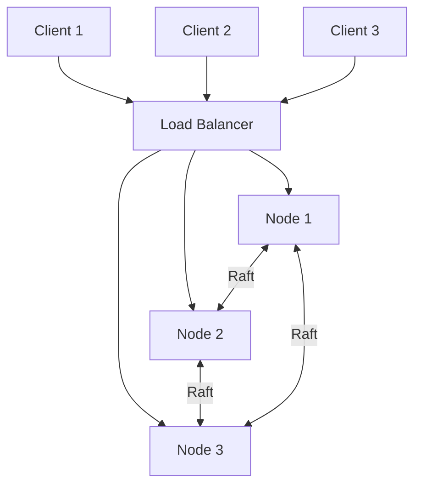

# Distri-place - Final report

Group 7 / Distributed Systems Course / 15.12.2025

Viljami Ranta, Ilari Heikkinen, Antti Ollikkala, Joni Pesonen

## Table of Contents

- [1. Introduction](#1-introduction)
- [2. Project Goals and Core Functionality](#2-project-goals-and-core-functionality)
- [3. Design Principles](#3-design-principles)
  - [3.1 System Architecture](#31-system-architecture)
  - [3.2 Processes and Components](#32-processes-and-components)
  - [3.3 Communication Model](#33-communication-model)
  - [3.4 Mapping of Design to Source Code](#34-mapping-of-design-to-source-code)
- [4. System Functionalities](#4-system-functionalities)
  - [4.1 Global State Management](#41-global-state-management)
  - [4.2 Consistency and Synchronization](#42-consistency-and-synchronization)
  - [4.3 Consensus Mechanism](#43-consensus-mechanism)
  - [4.4 Fault Tolerance and Recovery](#44-fault-tolerance-and-recovery)
- [5. Scalability Evaluation](#5-scalability-evaluation)
- [6. Performance Evaluation](#6-performance-evaluation)
  - [6.1 Performance Metrics](#61-performance-metrics)
  - [6.2 Experimental Setup](#62-experimental-setup)
  - [6.3 Performance Results](#63-performance-results)
  - [6.4 Performance Improvements](#64-performance-improvements)
- [7. Key Enablers and Lessons Learned](#7-key-enablers-and-lessons-learned)
- [8. Groupwork](#8-groupwork)
- [9. Appendices](#9-appendices)

# 1. Introduction

This is the final report of our project Distri-place. Distri-place is a shared canvas app that allows users to distributedly work on the same graphical canvas to create works of art.

In this report we will discuss the project design and implementation goals and technology from the lens of implementing a working distributed system. We go into the core functionality and give a detailed review of how key distributed system elements such as leader election, consistency and fault tolerance are implemented, what are the roles of different nodes in our system and much more.

# 2. Project Goals and Core Functionality

## 2.1 Project Objectives

The project objective was to be a shared canvas that works seamlessly with multitude of users each working on the canvas in real time.
The distributed aspects of the project that we mainly were focusing on were replication among multiple nodes, global synchronization and availability, so that the users are always able to connect to our system.

## 2.2 Core Features

Distributed systems elements are mostly implemented via RAFT-algorithm. We concluded after our initial design ([note in appendix](#9-appendices)) that with RAFT the project gets the key features that we expect from the distributed system. Those were the consistency and global synchronization, consensus via leader election and fault tolerance in case of errors happening that might compromise the current leader.

The core feature of our application for users is the ability to collaborate in coloring individual pixels of the canvas at the same time and seeing the canvas update in near real-time. Currently there is no limit to how often a user can color a pixel but in the original implementation (reddit.com/place) there are certain restrictions in place (time limit that user has to wait before being able to color again) to improve the user experience. Also for demo the size of our canvas is relatively small but in production environment our implementation could be scaled with small modifications to code to accommodate a much bigger canvas.

## 2.3 Potential Applications / Services Built on This Project

- As our application implements RAFT in a way that allows for strong consistency and availability and replication among nodes, there are a plethora of different possible uses for different kinds of applications. Our project may benefit for example from multi-raft scaling (more on that on scalability evaluation at #5). Our application has a very specific purpose as shared canvas so there are not a direct follow-up that could build onto this. However the underlying raft-implementation can be used for example in distributed databases, key-value stores or file management applications. So our project is mainly a standalone application.

# 3. Design Principles

## 3.1 Architecture

distri-place uses a leader-based replicated architecture with 3 server nodes.
Each node runs identical code but assumes different roles (leader, follower or candidate) based on Raft consensus.

- Client: Static HTML/JS page served locally with Nginx. Connects to load balancer for HTTP requests and WebSocket.
- Load Balancer: Simple Python round-robin proxy. Distributes client requests across the 3 nodes. In the demo running in melkki.
- Nodes: Python FastAPI servers. In the demo running in svm-11-1, svm-11-2, svm-11-3. Each node runs:
  - HTTP API (GET /client/pixels, POST /client/pixel)
  - WebSocket server for real-time updates
  - gRPC server for Raft communication with peers
  - In-memory canvas state (64x64 grid)

### 3.1.1 Why this architecture

- Full replication ensures any node can serve reads
- Leader-based writes provide strong consistency
- Raft unifies leader election and state replication in one protocol

### 3.1.2 Code mapping

- ./server/app/api/client/routes.py — FastAPI HTTP
- ./server/app/api/ws/routes.py — WebSocket handlers
- ./server/app/raft/node.py — Raft node logic
- ./server/app/raft/log.py — Raft log implementation
- ./server/app/grpc/server.py — gRPC server for inter-node communication
- ./server/app/grpc/client.py — gRPC client for inter-node communication
- ./server/app/canvas/state.py — Canvas state and pixel operations

## 3.2 Process

## 3.2.1 Startup sequence:

1. Node loads config (own ID, peer addresses, ports)
2. Starts gRPC server for inter-node communication
3. Starts FastAPI server for client connections
4. Initializes as Raft follower with randomized election timeout
5. If no heartbeat received, transitions to candidate and starts election

## 3.2.2 Leader election (Raft):

1. Follower times out → becomes candidate, increments term
2. Votes for itself, sends `RequestVote` to peers
3. If majority votes received → becomes leader
4. Leader sends periodic `AppendEntries` heartbeats to maintain authority

## 3.2.3 Node failure handling:

- Followers detect leader failure via heartbeat timeout (150-300ms)
- New election triggered automatically
- Rejoining node syncs log from current leader

## 3.3 Communication

### 3.3.1 Client - Server

| Protocol  | Endpoint         | Purpose                         |
| --------- | ---------------- | ------------------------------- |
| HTTP GET  | `/client/pixels` | Fetch current canvas pixels     |
| HTTP POST | `/client/pixel`  | Submit a new pixel              |
| WebSocket | `/ws`            | Receive real-time pixel updates |

### 3.3.2 Server - Server

| RPC             | Purpose                      |
| --------------- | ---------------------------- |
| `AppendEntries` | Logs replication + heartbeat |
| `RequesVote`    | Leader election              |

# 4. System Functionalities

## 4.1 Global State Management

The global state of the system consists primarily of the shared canvas, represented as a fixed-size 64×64 grid of pixels. Each pixel is defined by its coordinates and color value. This state is fully replicated across all nodes in the Raft cluster.

Rather than directly modifying the canvas state, all changes are expressed as log entries in the Raft log. A pixel placement operation is encoded as a deterministic command (x-coordinate, y-coordinate, color), which is appended to the leader’s log. Once the log entry is committed, it is applied to the in-memory canvas state on all nodes in the same order.

This approach ensures that:
 - All nodes eventually reach the same canvas state
 - State transitions are deterministic and replayable
 - New or recovering nodes can reconstruct the full canvas state by replaying the log

Reads (fetching the current canvas) can be served by any node, since all nodes maintain a replicated and up-to-date view of the global state once entries are committed.

## 4.2 Consistency and Synchronization

Distri-place provides strong consistency for write operations. At any given time, there is exactly one leader node responsible for accepting and ordering state changes. All pixel placement requests are either handled directly by the leader or forwarded to it if they arrive at a follower.

Consistency is achieved through the Raft log replication mechanism:

 1. The leader appends a new pixel operation to its log.
 2. The leader replicates the log entry to followers using AppendEntries RPCs.
 3. Once a majority of nodes acknowledge the entry, it is considered committed.
 4. The committed entry is then applied to the canvas state on all nodes.

Synchronization between clients is handled via WebSockets. After a log entry is committed and applied, the leader broadcasts the pixel update to all connected clients. This ensures that all users see updates in near real-time and in the same order, preserving a consistent view of the canvas.

## 4.3 Consensus Mechanism

Consensus in Distri-place is implemented using the Raft consensus algorithm. Raft is responsible for both leader election and agreement on the order of state changes.

## 4.4 Fault Tolerance and Recovery

Fault tolerance in Distri-place is achieved through replication and automated leader re-election. The system can tolerate failures of up to ⌊(N−1)/2⌋ nodes, where N is the total number of nodes in the cluster (in our case, one node out of three).

If the leader fails:
 - Followers stop receiving heartbeats.
 - After a timeout, a new leader election is triggered.
 - A new leader is elected without client intervention.

# 5. Scalability Evaluation
Our system is technically highly scalable. With our project implementation adding more nodes is very easy and it does not affect the functionality of the system. The nodes keep following the leader-candidate-follower election system and other methods as described in raft. However scaling with just one leader is not ideal for the use cases of our project and our project goals. More of this just down below at #6

Instead a better approach to scaling for our project would be for example to implement a multi-raft solution where the canvas is partitioned into multiple areas that each implement their own raft-environment. Each area would have their own leader and and followers for replication and fault tolerance. This approach would be a good option if our userbase were to grow very large and a single raft-cluster would experience congestion because of that. So the approach to scaling would have to be considered case by case and scaling just the single raft-cluster could be a good idea to a particular level.

# 6. Performance Evaluation

## 6.1 Latency

Pixel placement latency can be used to quantify the general perfomance of the system. It measures the time from client clicking a pixel to all clients seeing the updated canvas. The latency is built from a sequence of events:

Client click > Server receives > 2PC complete > WS broadcast > Client render

Most of the latency is from the Two-phase commit which runs for every new pixel. The most effective improvement would be to batch the requests so that you could commit multiple new pixels in one operation.

## 6.2 Throughput

Thoughput is the other important measure to quantify perfomance of the system. Our implementations uses a single leader for all writes for the full canvas. This is an obvious bottleneck when you add more clients. Successful commits per second measures the throughput for the system. Improving throughput could be done by sharding the canvas for multiple leaders. For example dividing the canvas into four regions which are managed by their own leaders.

# 7. Key Enablers and Lessons Learned

One of the key enablers of the project was the early decision to base the system on a well-established consensus algorithm. Choosing Raft significantly simplified the design of leader election, replication, and failure handling. Instead of implementing separate mechanisms for consensus, synchronization, and fault tolerance, Raft provided a good framework that covered all the concerns in a well documented way.

Another important enabler was the clear separation of concerns in the system architecture. Client-facing logic, consensus logic, and state management were implemented as distinct components. The modularity made the system easier to reason about, debug, and extend. It also allowed different group members to work on separate parts of the system in parallel without excessive coupling.

From an implementation perspective, using FastAPI and gRPC proved effective. FastAPI as a modern framework enabled rapid development of a clean client API, while gRPC provided an efficient and type safe RPC communication layer for inter node communication. 

A key lesson learned during the project was related to performance expectations in distributed systems. Initially, it was assumed that distributing the system across multiple nodes would naturally improve performance. However, it became clear that Raft is not optimal for workloads where distribution is expected to increase performance. In a leader-based consensus system, adding more nodes can actually might decrease performance due to increased coordination overhead, additional network communication, and the fact that all write operations must still pass through a single leader. While Raft scales well in terms of availability and reliability, it does not inherently scale write throughput. This realization motivated the discussion of alternative designs, such as multi-Raft or sharded architectures, where load can be distributed across multiple leaders.

# 8. Groupwork

- Everyone participated equally to the project planning phase and drawing the first sketches of our project. The big decisions were made together.

- Antti should get extra mention for the bigger effort on raft-implementation and Viljami for setting up the environment for the demo

- Overall we are happy with how everyone participated to the project

# 9. Appendices

## **Note - How our application implementation changed from the original plan**

- In our original project design-plan we considered using bully algorithm for the consensus. Instead we decided to implement the RAFT algorithm as it included the core functionalities that we wanted from our distributed system.

## Changes to our tech stack:

- Initially we thought about using TypeScript and React in the Front-end and Flask in the Back-end. However we decided to create the front-end without dedicated framework and in the back-end we used FastAPI with Python and added gRPC for communication between nodes.
