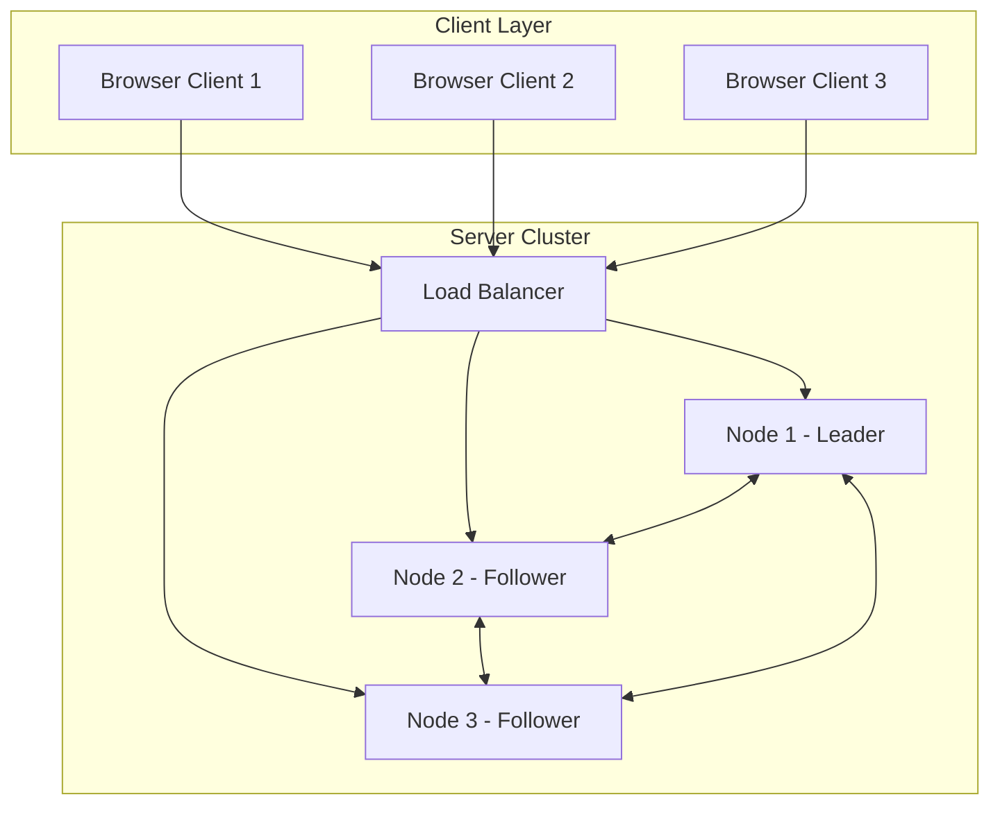

# distri-place: Distributed Collaborative Canvas

## Team Members

- Antti Ollikkala
- [Viljami Ranta](https://github.com/3nd3r1)
- Ilari Heikkinen
- Joni Pesonen

## Project Description:

distri-place is a distributed collaborative pixel canvas system inspired by r/place.
Users place colored pixels on a shared 100×100 canvas.
3 server nodes keep the canvas synchronized.

## System Architecture

## Solution

### Shared States

- Full replication - each node stores complete 100×100 canvas in memory

### Consistency & Synchronization

Leader coordinates pixel updates using Two Phase Commit:

- Client sends pixel to any node
- That node forwards to leader
- Leader asks followers to commit
- If majority agrees, leader commits

### Consensus

- Leader election using Bully algorithm (highest node ID becomes leader)

### Fault Tolerance

- Heartbeats: TCP keepalive every 2s between all nodes
- Failure detection: 6s timeout marks node as failed and trigger election
- Recovery: Rejoining node requests full state from any active peer

## Messages

### Client ↔ Server

#### HTTP (REST)

- Place a pixel - POST /pixel
- Get the canvas - GET /canvas

#### WebSocket

- Real-time pixel updates when any user places a pixel

### Server ↔ Server (TCP/JSON)

- PREPARE/VOTE/COMMIT - 2PC
- HEARTBEAT - keepalive
- ELECTION/COORDINATOR - Leader election
- SYNC_REQUEST/SYNC_RESPONSE - State synchronization

## Scalability Discussion

### Bottlenecks

- Leader bandwidth: All writes through leader
- Full replication: Each node stores full canvas
- 2PC overhead
- websocket limit

### Large Scale

- Sharding of the canvas
- Caching: CDN for the GET requests
- Load balancing: Making the loadbalancer more smart
- Batching: commit many pixels

## Stack

### Frontend

- TypeScript
- React.js - SPA
- WebSocket client for real-time pixel updates
- Canvas rendering using HTML5 Canvas API or React component library
- HTTP client (fetch/axios) for initial data loading and pixel placement

### Backend

- Python
- Flask
- TCP sockets

### Deployment

- Development: Local machines (localhost with different ports) or Docker-compose?
- Production: University svm servers (svm-11.cs.helsinki.fi, svm-11-2, svm-11-3)
- Load Balancer: Nginx reverse proxy for distributing client requests across nodesRetry
